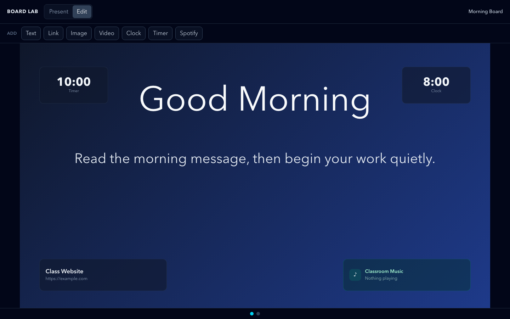
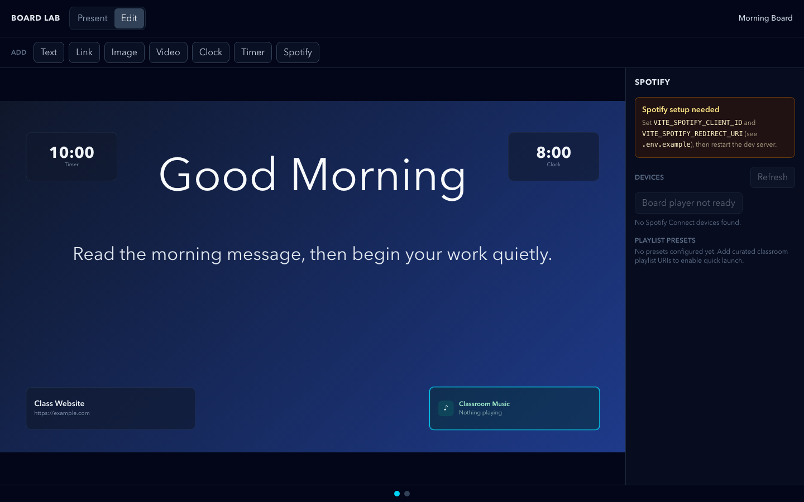

# DB-2A — Spotify Level 2 Vertical Slice

Status: Complete (no live OAuth — `configMissing` path only)

Branch: `db-2a-spotify-level-2-vertical-slice`

## What was implemented

The first real Spotify Level 2 integration slice, isolated inside the Clean
Board Lab lane (`src/features/clean-board/spotify/`). It does **not** touch or
import the old Command Center `classroom-atmosphere` music/embed model.

| Boundary | File | Responsibility |
| --- | --- | --- |
| Types + constants | `spotifyTypes.ts` | `SpotifyStatus`, `SpotifyDevice`, `NowPlaying`, `SpotifyTokens`, scopes, endpoints |
| Config | `spotifyConfig.ts` | Pure `resolveSpotifyConfig` (missing-config detection) |
| PKCE | `spotifyPkce.ts` | verifier, S256 challenge, state, auth URL, callback parser |
| Safety | `spotifySafety.ts` | `toSafeNowPlaying` student-safe projection |
| Storage | `spotifyStorage.ts` | `clean-board.spotify.*` keys, token expiry calc |
| Web API | `spotifyApi.ts` | devices, currently-playing, transfer, play/pause/next/prev |
| Auth | `spotifyAuth.ts` | code→token exchange, refresh (no client secret) |
| SDK | `spotifyPlaybackSdk.ts` | Web Playback SDK load + browser device creation |
| Store | `spotifyStore.ts` | Zustand singleton: handshake, token lifecycle, SDK, controls |
| Teacher UI | `SpotifyTeacherPanel.tsx` | connect/disconnect, status, devices, transfer, transport, presets |
| Student UI | `SpotifyNowPlayingWidget.tsx` | pure presentational now-playing widget |
| Tests | `spotifyTests.ts` | 19 pure-logic tests |

The `spotifyNowPlayingPlaceholder` board object now renders the safe
now-playing widget (via `BoardObjectRenderer`). In Edit mode, selecting that
object opens the teacher panel in a right-hand drawer **outside** the board.
Present mode only ever shows the student-safe widget.

## Required Spotify Developer App setup

1. Create an app at <https://developer.spotify.com/dashboard>.
2. Add the redirect URI (must match `VITE_SPOTIFY_REDIRECT_URI` exactly):
   - `http://localhost:5173/board-lab`
   - optionally `http://127.0.0.1:5173/board-lab`
3. Copy the Client ID (never the Client Secret — it is not used).

## Required environment variables

Create `.env.local` (see `.env.example`):

```
VITE_SPOTIFY_CLIENT_ID=
VITE_SPOTIFY_REDIRECT_URI=http://localhost:5173/board-lab
```

No `.env` with real values is committed; `.env` and `.env.*` are gitignored
(`.env.example` is the only exception).

## Scopes

- `user-read-playback-state`
- `user-modify-playback-state`
- `user-read-currently-playing`
- `streaming`

## Premium requirement

Web Playback SDK playback requires a Spotify Premium account. The SDK
`account_error` event maps to the `premiumRequired` status and is shown
gracefully in the teacher panel ("Spotify Premium is required").

## iPad / iOS caveats

Volume control is deliberately omitted. iPad/iOS volume behavior is limited
(Spotify Connect devices expose hardware volume, not software volume), so this
slice does not promise any volume control.

## Token storage risks (documented, accepted for this slice)

- Tokens are stored in `localStorage` (`clean-board.spotify.tokens`) so a
  refresh survives reloads. `localStorage` is accessible to XSS, so this is
  **not** production-hardened.
- The PKCE `code_verifier` and `state` are stored in `sessionStorage`
  (`clean-board.spotify.code_verifier`, `clean-board.spotify.state`) and cleared
  immediately after use.
- No token, secret, or private account data is ever logged, rendered in present
  mode, or written to docs/screenshots.

## Deliberately not production-hardened yet

- No silent refresh/rotation strategy beyond the single refresh grant.
- No device polling/WebSocket — devices and playback are fetch-on-demand.
- Playlist presets are defined as an interface with an **empty** default list;
  no hardcoded Spotify catalog URIs and no fake functioning buttons.
- Web Playback SDK device and transfer/playback are API-wrapper ready but
  unproven against a live account in this phase (no config/premium available).

## Validation results

| Command | Result |
| --- | --- |
| `npm run build` | PASS |
| `npm run test:clean-board` | PASS (14/14) |
| `npm run test:clean-board-spotify` | PASS (19/19) |
| `npm run test:display-studio` | PASS (124/124) |
| `npm run test:display-composer` | PASS |
| `npm run test:display-import-guard` | PASS |
| `npm run test:display-bundle-guard` | PASS |
| `npm run test:teacher-dock` | PASS |
| `npm run lint` | WARN (3 pre-existing canvas-spike fast-refresh errors; 0 new) |

## PASS / WARN / FAIL

**PASS**

- Spotify Level 2 service boundaries exist (`spotify/` isolated module set).
- PKCE helpers exist and are tested (verifier/challenge shape, auth URL, state).
- Missing config is graceful — `configMissing` state, "Spotify setup needed"
  UI, no crash.
- Teacher-only control panel exists in `/board-lab` Edit mode.
- Student-safe now-playing widget exists (`toSafeNowPlaying` whitelist).
- No token/secret/private account data leaks into present projection.
- No old Level 1 embed/player or cluttered shell imports (guard-enforced).
- Build + all clean-board/display guards pass.
- Documentation + screenshots created.
- No secrets or `.env` committed.

**WARN**

- Real OAuth not manually completed (no Spotify Client ID provided).
- Web Playback SDK device creation unverified against a Premium account.
- Device transfer / playback controls are API-wrapper ready but unproven live.
- Volume controls omitted/deferred (iPad limitation).

**FAIL**

None.

## Screenshots






Screenshots contain no tokens, email, account ID, or private data.
