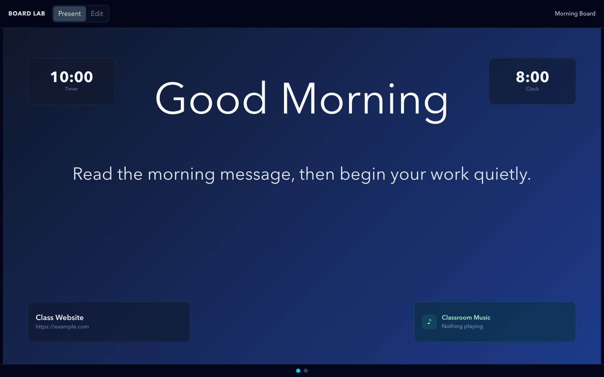

# DB-2B — Live Spotify OAuth + Premium Device Validation

Status: **Live bugfix complete; live OAuth/playback validated to PARTIAL PASS.
State-handling bug fixed and unit-tested. Awaiting Owen's retest of the fixed UI.**

Branch: `db-2b-live-spotify-validation`

## Summary

DB-2B is the live-integration validation phase for the DB-2A Spotify Level 2
vertical slice. Two rounds of work landed here:

1. **Round 1 (commit `49974ce`)** fixed the OAuth callback routing, SDK player
   lifecycle, and raw-device-ID leakage.
2. **Round 2 (this commit)** fixed the state-handling bug observed during live
   testing: the panel showed "Error" + "Connect Spotify" even though a valid
   token existed and playback commands reached Spotify.

## Observed initial bug (live)

During live testing with a real Client ID and Spotify Premium:

- App reached the Spotify panel and completed OAuth.
- Pressing Play could start music in the regular Spotify app.
- But the board panel still showed **Status: Error**, **Connect Spotify**, and
  the stale message **"Could not start playback."**, plus **"No Spotify Connect
  devices found."**

## Root cause

`spotifyStore.ts` used a single `status` field that conflated **auth** with
**operational** state. Every transient failure (`apiError` on a failed `play`,
`deviceUnavailable` on an empty device list) overwrote the `connected` status.
The panel then computed `isConnected = status === 'connected'`, which became
false, so it re-rendered "Connect Spotify" and disabled controls — even though
the token was valid and playback commands were actually working. Errors were
also never cleared on success, and playback state was not refreshed after
commands.

## Bugfix summary

Split the single status into two independent axes:

- `SpotifyAuthStatus` — `configMissing | loggedOut | authorizing | connected |
  tokenExpired` (the ONLY axis that decides "Connect" vs "Disconnect").
- `SpotifyOpStatus` — `idle | premiumRequired | sdkUnavailable |
  deviceUnavailable | playbackRestricted | apiError` (degraded states within an
  authenticated session).

Behavior changes:

1. A valid token keeps `authStatus === 'connected'` regardless of SDK/device/
   playback outcomes, so the panel never flips to "Connect Spotify" while
   authenticated.
2. `errorMessage` is cleared at the start of every command and on success;
   stale `apiError` is reset to `idle` (`onCommandStart` / `onCommandSuccess`).
3. Play/pause/next/previous/transfer/launchPreset now refresh playback state
   after success; if the refresh fails, a WARN notice ("command sent; could not
   refresh playback") is shown instead of a false disconnected state.
4. Device refresh updates `devices` or sets a no-device warning
   (`deviceUnavailable`) or an op error (`apiError`) — none of which erase auth.
5. SDK browser device unavailable (`sdkUnavailable`) or Premium required
   (`premiumRequired`) keep the API controls usable against an existing Spotify
   Connect device.

The transitions are encoded in a pure, unit-tested reducer
(`spotifyState.ts`).

## Setup steps used

1. `VITE_SPOTIFY_CLIENT_ID` and `VITE_SPOTIFY_REDIRECT_URI` are read from
   `import.meta.env` (no client secret).
2. `.env.local` is the local-only location (gitignored); `.env.example` is the
   committed template.
3. Redirect URI registered in the Spotify Developer Dashboard:
   - `http://localhost:5173/board-lab`
   - `http://127.0.0.1:5173/board-lab`
4. Helper: `bash scripts/check-spotify-env.sh` verifies `.env.local` is
   populated **without printing values**.

## Live validation results

| Item | Result |
| --- | --- |
| Live OAuth login | **PARTIAL/PASS** — token issued; playback commands reach Spotify |
| Return to `/board-lab` | **PASS** (callback routing fixed in round 1) |
| Token stored under `clean-board.spotify.*` | **PASS** (storage module) |
| No tokens printed/logged | **PASS** (log-guard test + grep) |
| Spotify Connect devices loaded | **WARN** — devices not reflected before fix |
| Web Playback SDK browser device | **WARN** — not yet proven (Premium-dependent) |
| Transfer playback | **NOT PROVEN** — blocked on device state before fix |
| Play / pause / next / previous | **PARTIAL PASS** — Play started Spotify; UI stale |
| Current-track metadata in teacher panel | **WARN** — not yet confirmed after fix |
| Present mode student-safe only | **PENDING** — needs final check after retest |
| iPad present-mode safety | **NOT TESTED** |

## Screenshots

Safe screenshots (no tokens/codes/email/account IDs/raw device IDs):

Connected/device-list screenshots are intentionally not captured in this pass —
a live session would risk exposing device IDs, account email, or private data.
They will be added only if a clean, redacted capture is possible.

## Validation commands / results

| Command | Result |
| --- | --- |
| `npm run build` | PASS |
| `npm run test:clean-board` | PASS (14/14) |
| `npm run test:clean-board-spotify` | PASS (30/30) |
| `npm run test:display-import-guard` | PASS |
| `npm run test:display-bundle-guard` | PASS |
| `npm run test:teacher-dock` | PASS |
| `npm run test:display-studio` | PASS |
| `npm run test:display-composer` | PASS |
| `npm run lint` | WARN (3 pre-existing canvas-spike fast-refresh errors; 0 new) |

## PASS / WARN / FAIL

**PASS**

- Auth state fully separated from SDK/device/playback op state.
- Valid token no longer renders as logged-out on a command/device failure.
- Stale `apiError` cleared on command start/success.
- Play/pause/next/previous/transfer refresh playback after success.
- No-device shows a warning, not a false disconnect.
- Pure reducer unit-tested (10 new assertions).
- Build + all clean-board/display guards pass.
- No secrets, `.env`, or tokens committed.

**WARN**

- Live device discovery and SDK browser device still need retest after this fix.
- Transfer to board player not yet proven.
- Current-track metadata not yet confirmed post-fix.
- Present-mode safety needs final check.

**FAIL**

None.

## Confirmations

- No client secret introduced anywhere.
- No `.env` / `.env.local` committed (only `.env.example`; `.env`/`.env.*`
  gitignored).
- No token, code, email, account ID, or device ID in screenshots or docs.
- Student-safe now-playing still whitelists via `toSafeNowPlaying`.
